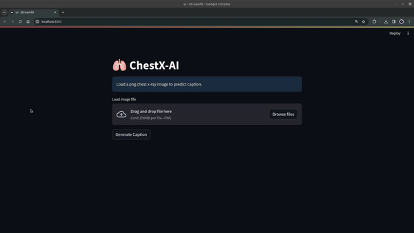
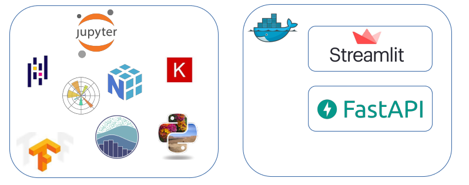

# ChestX-AI
It's a machine learning project for image captioning on radiological Chest X-ray images. NLP is used for captioning, image processing and CNN used for feature extraction of images.  

 

 <b>Figure 1. ChestX-AI Demo</b>

## Technologies 

 

 <b>Figure 2. Technology Stack</b>

# Setup & Deployment

Model files are big so not uplodaded in this repo. However you can download these from <a href="https://drive.google.com/drive/folders/1-Ob7w1VYhxYyGfrnaR2Jrc5wkqvdisFt?usp=sharing">this link</a>

## Prerequisites
- Download models(`*.pkl & *.h5 files`) from link is above.
- Go to `project folder > fastapi_backend > models` and <b>move downloaded models into the folder.</b>

## Deployment
- First usage: ` docker-compose up -d --build`  
- Already build: ` docker-compose up -d `
- For shutdown: ` docker-compose down`
- Voila! Now you can use your product in <a href="http://localhost:8030">your localhost http://localhost:8030 .</a>

# To-Do:

- <s>Dockerize version</s> 
- AWS S3 or GDrive API connection to retrieve models
- Evaluating model & hyperparameter-finetuning
- model finetuning : Attention based model 
- Create a PDF like a radiologist report. (Some textboxts will add to UI about patient)

# Dataset
Open-i service of the National Library of Medicine enables search and retrieval of abstracts and images (including charts, graphs, clinical images, etc.) from the open source literature, and biomedical image collections. Searching may be done using text queries as well as query images. Open-i provides access to over 3.7 million images from about 1.2 million PubMed Central® articles; 7,470 chest x-rays with 3,955 radiology reports; 67,517 images from NLM History of Medicine collection; and 2,064 orthopedic illustrations.

Longer descriptions are available in a research article "Design and Development of a Multimodal Biomedical Information Retrieval System" ( http://lhncbc.nlm.nih.gov/system/files/pub2012019.pdf ) and a technical report ( http://lhncbc.nlm.nih.gov/system/files/tr2010002.pdf )

Open-i images are from one of the following sources:
- The Open Access Subset of PubMed Central (PMC), a free full-text archive of biomedical and life sciences journal literature at the U.S. National Library of Medicine.
- The Indiana University hospital network.
- The Orthopedic Surgical Anatomy Teaching Collection (http://digitallibrary.usc.edu/cdm/landingpage/collection/p15799coll50) at the USC Digital Library (http://digitallibrary.usc.edu/).
- Images from the History of Medicine Division (https://www.nlm.nih.gov/hmd/) from the U.S. National Library of Medicine.
- MedPix (https://medpix.nlm.nih.gov/)
>Reuse of Open-i images is determined by the license type of the image. A link to the applicable license type, if available, may be found below the individual Open-i image on the detailed view page.
>Please refer to the following web page for information on the PMC open access subset and the PMC Copyright Notice:
>http://www.ncbi.nlm.nih.gov/pmc/tools/openftlist/
>http://www.ncbi.nlm.nih.gov/pmc/about/copyright/

- You can get more information about dataset from <a href="https://openi.nlm.nih.gov/faq#collection">this link</a> .
- You can download images from <a href="https://openi.nlm.nih.gov/imgs/collections/NLMCXR_png.tgz">this link</a> .
- You can download image reports from <a href="https://openi.nlm.nih.gov/imgs/collections/NLMCXR_reports.tgz">this link</a> .

